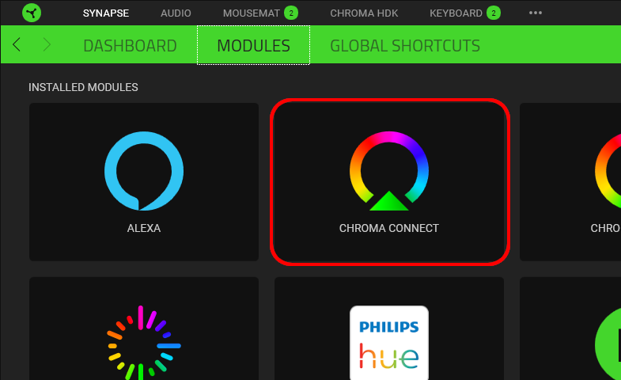
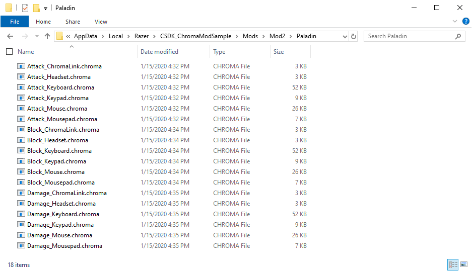

# C++ Chroma MOD Sample #

**Table of Contents**

* [See Also](#see-also)
* [Quick Start](#quick-start)
* [About](#about)

<a name="see-also"></a>
## See Also

**Docs:**

- [Chroma Animation Guide](http://chroma.razer.com/ChromaGuide/) - Visual examples of the Chroma Animation API methods

**Apps:**

- [ChromaClientForDiscord](https://github.com/tgraupmann/ChromaDiscordApp) - Add Chroma lighting to the Discord App events

- [ChromaClientForTwitch](https://github.com/tgraupmann/ChromaTwitchExtension) - Add Chroma lighting to the Twitch streaming experience

**Plugins:**

- [CChromaEditor](https://github.com/RazerOfficial/CChromaEditor) - C++ native MFC library for playing and editing Chroma animations

- [ClickTeamFusion_ChromaSDK](https://github.com/RazerOfficial/ClickTeamFusion_ChromaSDK) - Click Team Fusion Chroma SDK Extension for playing Chroma animations

- [GameMakerChromaExtension](https://github.com/RazerOfficial/GameMakerChromaExtension) - GameMaker extension to control lighting for Razer Chroma

- [Godot_ChromaSDK](https://github.com/RazerOfficial/Godot_ChromaSDK) - Godot native library for playing Chroma animations

- [HTML5ChromaSDK](https://github.com/RazerOfficial/HTML5ChromaSDK) - JavaScript library for playing Chroma animations

- [UE4_XDK_SampleApp](https://github.com/razerofficial/UE4_XDK_SampleApp) - UE4 Chroma samples and runtime module with Blueprint library for the ChromaSDK

- [UnityNativeChromaSDK](https://github.com/RazerOfficial/UnityNativeChromaSDK) - Unity native library for the ChromaSDK


<a name="quick-start"></a>
## Quick Start ##

* Install [Synapse](https://www.razer.com/synapse-3)

* Make sure the Chroma Connect module is installed.



* If you don't have Chroma hardware, you can see Chroma effects with the [Chroma Emulator](https://github.com/razerofficial/ChromaEmulator)


<a name="about"></a>
## About ##

This is a C++ console application which shows how to create a Chroma RGB lighting enabled application that is moddable.


The sample application has default `BASE` animations that mods can override.

```
Animations
└───Base
    ├───Fighter
    ├───Paladin
    └───Thief
```

Mods are controlled using a directory naming convention described in the [setup](#setup) section.

## Setup

Mod folders with custom Chroma animations can be placed within `Mods` subfolder of the application folder.

```
%USERPROFILE%\AppData\Local\Razer\CSDK_ChromaModSample\Mods
```


Two sample mods can be found in the `Animation` folder.

* [Mod1.zip](Animations/Mod1.zip)
* [Mod2.zip](Animations/Mod2.zip)

Both mods can be unpacked within the application folder. Mods are detected when the application starts.

```
%USERPROFILE%\AppData\Local\Razer\CSDK_ChromaModSample\Mods
├───Mod1
│   ├───Fighter
│   ├───Paladin
│   └───Thief
└───Mod2
    ├───Fighter
    ├───Paladin
    └───Thief
```

Mods use the directory template of `MOD NAME` | `CLASS NAME` | `EFFECT`.

Each mod has a sample class for `FIGHTER` | `PALADIN` | `THIEF`.

Each class has a sample effect for `ATTACK` | `BLOCK` | `DAMAGE`.

Each effect has a device Chroma animation for `CHROMALINK` | `HEADSET` | `KEYBOARD` | `KEYPAD` | `MOUSE` | `MOUSEPAD`.


