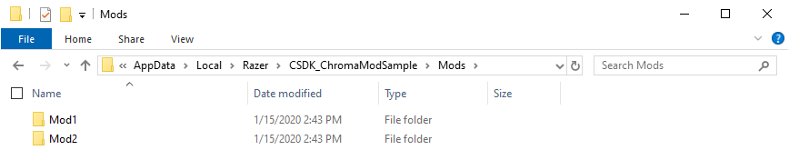

# C++ Chroma MOD Sample

This is a C++ console application which shows how to create a Chroma RGB lighting enabled application that is moddable.


The sample application has default `BASE` animations that mods can override.

```
Animations
└───Base
    ├───Fighter
    ├───Paladin
    └───Thief
```

Mods are controlled using a directory naming convention described in the [setup](#setup) section.

## Setup

Mod folders with custom Chroma animations can be placed within `Mods` subfolder of the application folder.

```
%USERPROFILE%\AppData\Local\Razer\CSDK_ChromaModSample\Mods
```



Two sample mods can be found in the `Animation` folder.

* [Mod1.zip](Animations/Mod1.zip)
* [Mod2.zip](Animations/Mod2.zip)

Both mods can be unpacked within the application folder. Mods are detected when the application starts.

```
%USERPROFILE%\AppData\Local\Razer\CSDK_ChromaModSample\Mods
├───Mod1
│   ├───Fighter
│   ├───Paladin
│   └───Thief
└───Mod2
    ├───Fighter
    ├───Paladin
    └───Thief
```

Mods use the directory template of `MOD NAME` | `CLASS NAME` | `EFFECT`.

Each mod has a sample class for `FIGHTER` | `PALADIN` | `THIEF`.

Each class has a sample effect for `ATTACK` | `BLOCK` | `DAMAGE`.

Each effect has a device Chroma animation for `CHROMALINK` | `HEADSET` | `KEYBOARD` | `KEYPAD` | `MOUSE` | `MOUSEPAD`.
